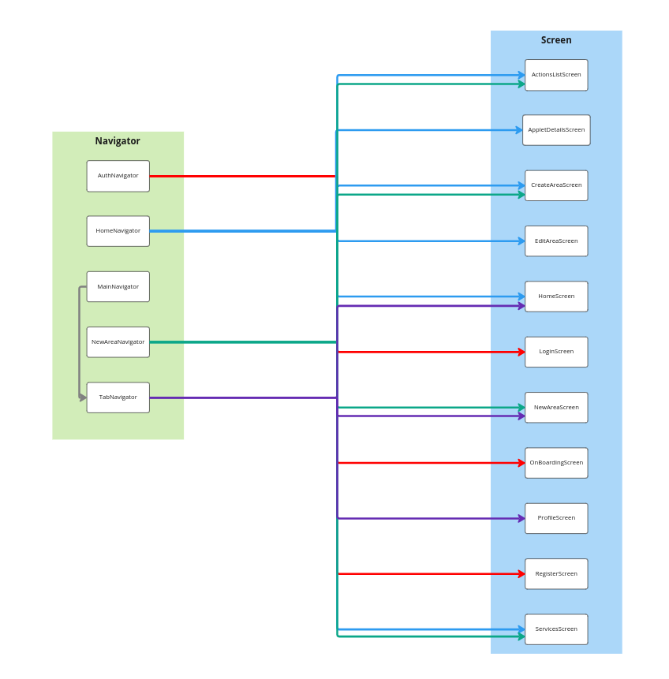
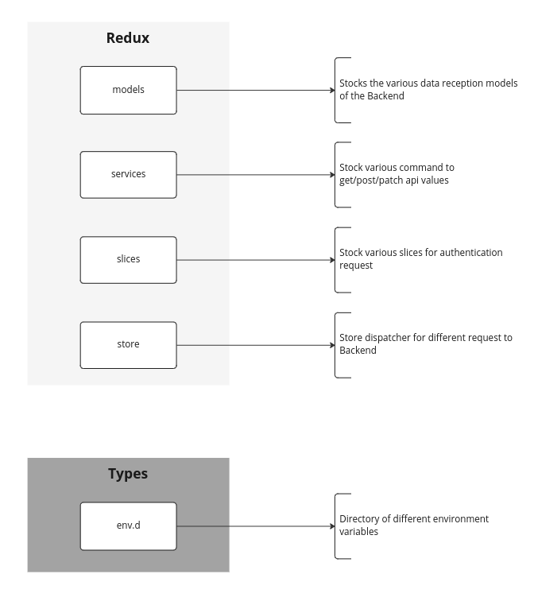
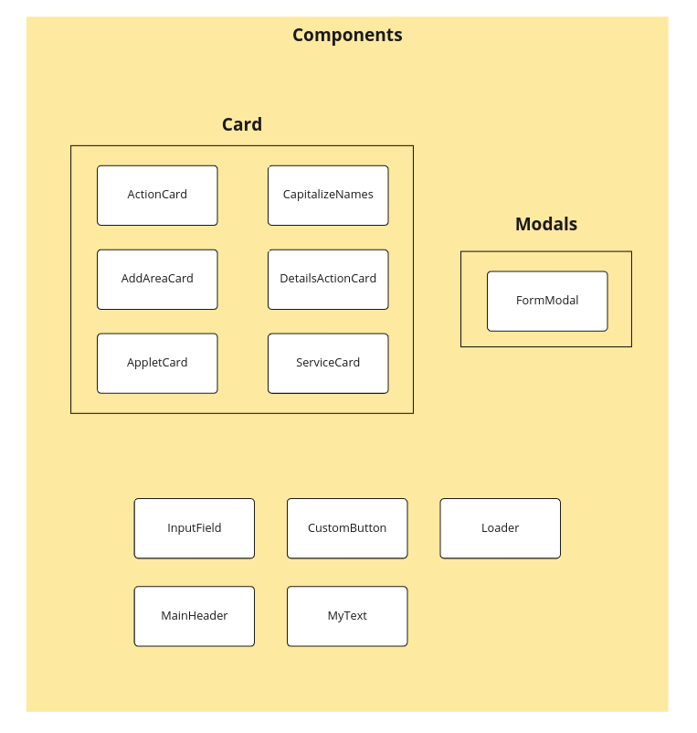

<p align="center">
  <a target="blank"></a>
</p>

## :gear: Environment Variables :gear:

To run mobile app, you firstly need to edit your configuration environment file.

At the root of the mobile directory, you can find a `.env.example` file containing those values :
```bash
# API Endpoint for IOS emulator
REACT_NATIVE_APP_API_URL=http://localhost:8080/api/reaccoon

#---------- OR ----------#

# API Endpoint for ANDROID emulator
REACT_NATIVE_APP_API_URL=http://10.0.2.2:8080/api/reaccoon
```

You just have to duplicate it as a `.env` file and to fill the empty values. **All of them are mandatory**.

## :hammer: Installation :hammer:

To use Reaccoon, clone the repository.
```bash
# Via SSH
git clone git@github.com:EpitechPromo2025/B-DEV-500-PAR-5-2-area-martin.vanaud.git reaccoon

# Via HTTPs
https://github.com/EpitechPromo2025/B-DEV-500-PAR-5-2-area-martin.vanaud.git reaccoon
```

Go to the project mobile directory.
```bash
cd reaccoon/mobile
```

Then, just before running the Reaccoon mobile application, install expo app on your emulator with this command.

```bash
npx expo start
```

*Then enter a character to choose the emulator you want to use.*


And Voilà ! **Your app is running !** :tada:

## :book: Documentation :book:

Here is a representation of the links between screens and navigators :
<p align="center">
  <a target="blank"></a>
</p>

Here is a representation of the folder containing the various calls to the database API :
<p align="center">
  <a target="blank"></a>
</p>

Here is a representation of the different components available :
<p align="center">
  <a target="blank"></a>
</p>

## :busts_in_silhouette: Authors :busts_in_silhouette:

DevOps & Backend Team :
- [@martinvanaud](https://www.github.com/martinvanaud)
- [@tibo-pdn](https://www.github.com/tibo-pdn)
- [@Gurvan-Le-Letty](https://www.github.com/Gurvan-Le-Letty)

Mobile & Frontend Team :
- [@maxime-carabina](https://www.github.com/maxime-carabina)
- [@victorpalle](https://www.github.com/victorpalle)
- [@Clement-Fernandes](https://www.github.com/Clement-Fernandes)

